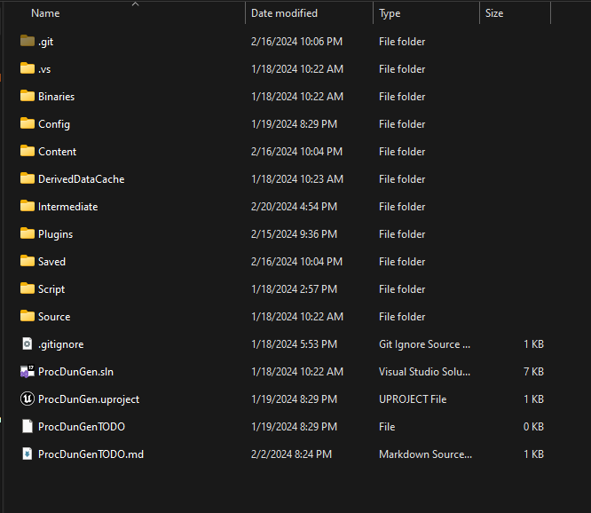
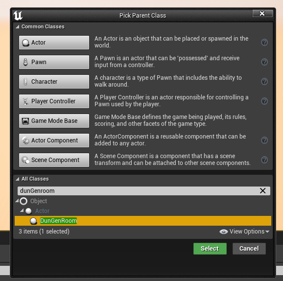
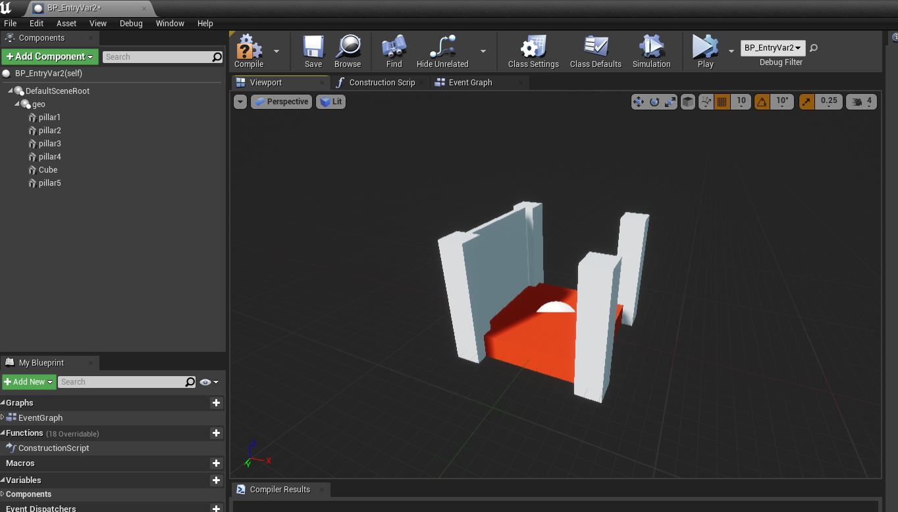
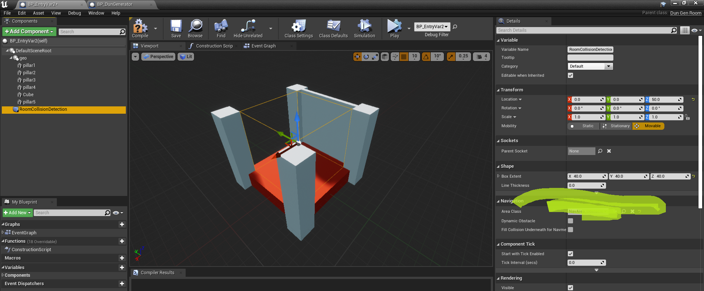
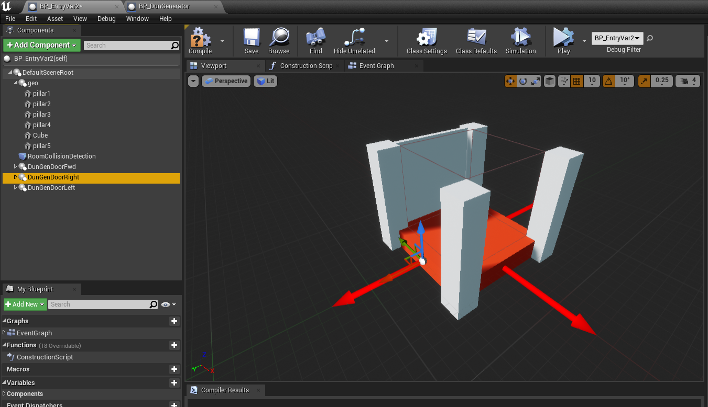

# ProcDunGen Unreal Plugin v0.2.1 Documentation
Procedural Dungeon Layout generation plugin for Unreal Engine ver. 4.27

----
## Table Of Contents
<!-- TOC start (generated with https://github.com/derlin/bitdowntoc) -->

- [Importing the plugin](#importing-the-plugin)
- [Setting up your Unreal Project for use with this plugin](#setting-up-your-unreal-project)
- [Updating your Plugin to a newer version](#updating-your-plugin)
- [Step-By-Step Building your own DunGenRoom BP](#step-by-step-building-your-own-dungenroom-bp)
- [The DunGenerator actor](#the-dungenerator-actor)
- [C++ Class Documentation](#c-class-documentation)
   * [DunGenerator](#dungenerator)
      + [Properties](#properties)
      + [Functions](#functions)
   * [DunGenRoom](#dungenroom)
      + [Properties](#properties-1)
      + [Functions](#functions-1)
- [ChangeLog](#changelog)
   * [Verison 0.2.0](#v0.2.0)
   * [Version 0.2.1](#v0.2.1)

<!-- TOC end -->

<!-- TOC -->
## Importing the plugin
1. After downloading and extracting the plugin, navigate to the Unreal Project you would like to add it to.
2. Create a Plugins folder if your project does not already have one: 

    

3. Copy the ProceduralDunGen folder into the plugins folder.
4. If you would like to include ProcDunGen starter content, copy that folder into your project's content folder.

<!-- TOC -->
## Setting up your Unreal Project for use with this plugin

In the event you are using a Blueprint only project, you will have to have one C++ source file included in your project for this to build (due to a bug introduced in 4.24/5). To do this, create a dummy C++ class, close your project, delete your Intermediate, Build, and Binaries folders, and then reopen the project. 

<!-- TOC -->
## Updating your Plugin to a newer version

In the event you have set up a previous version of this plugin, all you should have to do is replace the ProceduralDunGen folder in your plugins folder with the newer version. 

<!-- TOC -->
## Step-By-Step Building your own DunGenRoom BP
1. Create a blueprint class using the DunGenRoom C++ class as a base:
 

    

2. Set up the geometry for your room:
   - If using static meshes, create a static mesh component and assign the desired models to it
   - Otherwise, you can use primitive shapes to define the geometry of your room in the prototype stage.
   
   

    

4. Add a Box Collision Component, Sphere Collision Component, or Capsule Collision Component to define the area your room occupies:
    
    **At least one of the above components are required for each room**  
   - Use a convention that best suits your project either:
      - Size the component such that it completely encapsulates the geometry of the room (if you do not want walls to overlap)
      - OR size it so that it is only occupying the inner bounds of the room (if you dont care if walls overlap with each other)
    - As a best practice, keep the scale of the volume uniform and adjust the size using the shape field:
     
      

    

6. Add a DunGenDoor component to the room:
    
    **At least one DunGenDoor is required for each room**

    - Place the door at the location you would want to act as the "pivot" between rooms. Rooms will be placed such that their paired doors will have the same world position and face opposite directions. 
    - After placing the door at your desired position, rotate it so that the X axis points in the direction you want the door to point to:
    
         

    

You can also refer to the StarterContent rooms to get ideas for how to set up your own rooms.

<!-- TOC -->
## The DunGenerator actor
1. Create a blueprint actor based on the DunGenerator class like you did with the DunGenRoom actor.
2. Specifying a set number of rooms for your dungeon:
    - Toggle the RoomLimit field on your DunGenerator actor.
    - This will cause the MaxRoomCount field to become visible and editable.
3. Specify the use of a random or pre determined seed:
    - Toggle the UsePredefinedSeed field for your DunGenerator actor.
    - This will cause the RandomSeedVal to become visible and editable.
    - RandomSeedVal has a min/max corresponding to the Int32 data type.
4. Specify if you want the dungeon to be generated on "Play":
    - toggle the GenerateOnStart field.
5. Add your rooms to their corresponding lists:
    - EntryRooms - all rooms you want to be the *first* room the generator will spawn. Cannot contain any rooms contained in the ExitRooms list.
    - ExitRooms - all rooms you want to be the *last* room the generator will spawn. Rooms contained in this list should not be placed in EntryRooms or DungeonRooms.
    - DungeonRooms - all other rooms that you want to make up the rest of the dungeon. Cannot contain any rooms contained in the ExitRooms list.
6. Place your DunGenerator actor in your level
7. Generate dungeons!
    - Use the "GenerateDungeon" button to generate a dungeon given the constraints and rooms specified above.
    - NOTE: The entry point of the dungeon will *always* occupy the *same world location and rotation as the dungeon generator!*
    - To quickly remove a previously spawned dungeon, press the "CleanUp" button.

----
<!-- TOC -->
# C++ Class Documentation
<!-- TOC -->
## DunGenerator
<!-- TOC -->
### Properties
#### bool RoomLimit
- If set to true, will generate MaxRoomCount rooms unless that number is not possible without rooms overlapping. 

- Toggles visibility of MaxRoomCount.

- If set to false, will generate rooms randomly until an exit room is generated. Exit room is determined by if TArray ExitRooms contains the spawned room.  

#### int MaxRoomCount
- Controls the number of rooms the dungeon generator will spawn if RoomLimit is set to 'true'

#### bool UsePreDefinedSeed
- If set to true, will allow the user to specify the in32 seed used to generate the rooms. 

- Toggles visibility of RandomSeedVal.

- If set to false, will generate a random seed on compile time.

#### int32 RandomSeedVal
- Int32 value that defines the random number generator seed used by the Dungeon Generator.

#### TArray<ADunGenRoom*> EntryRooms
- List containing all rooms that you would like to use to start the dungeon.

- Only one of these rooms will be spawned per generation. 

- This is guaranteed to be the first room spawned by the generator.

#### TArray<ADunGenRoom*> ExitRooms
- List containing all rooms that you would like to use to end the dungeon.

- Only one of these rooms will be spawned per dungeon. 

- This is guaranteed to be the last room spawned by the generator.

#### TArray<ADunGenRoom*> DungeonRooms
- List of rooms you would like to use to fill the dungeon.

- If defining a room limit, N rooms will spawn where N = MaxRoomCount - 2.

#### TArray<ADunGenRoom*> SpawnedRooms
- List of rooms the dungeon generator spawned after generating a dungeon. 

#### bool GenerateOnStart
- If true, when you BeginPlay on this level, it will generate a completely new dungeon.

<!-- TOC -->
### Functions
#### CleanUp()
- Iterates through the list of SpawnedRooms and marks each spawned DunGenRoom Actor for Destroy.

- Clears out list after destruction.

#### GenerateDungeon()

- Responsible for generating a dungeon.
- If RoomLimit is set to true, the generator will generate rooms until that value is reached OR there are no valid rooms the generator can spawn. If RoomLimit is set to false, it will generate rooms until an ExitRoom is spawned.

#### UDunGenDoor* GetValidExit(ADunGenRoom* room, int& absIdx)
- Given a room, will return a valid Door for the given room. Additionally assigns to a passed in integer value for having access to the index of the valid Door in the OpenDoors() list on the given room.

#### ADunGenRoom* SpawnValidRoom(UDunGenDoor* entrance)
- Responsible for spawning a valid room. Behavior changes if there is a RoomLimit in place.

#### RotateAroundPoint(UDunGenDoor* prevRoomExit, UDunGenDoor* curRoomEntry, ADunGenRoom* curRoom)
- Helper method used to rotate a room so that the previous exit and current Entry face opposite directions.

#### RepopulateBranchingRooms()
- Helper method used to repopulate the private list PossibleBranchRooms that is used if a room overlap is detected. Repopulated *only* when an overlap is detected. Valid rooms are those with any open doorways. 

<!-- TOC -->
## DunGenRoom
<!-- TOC -->
### Properties

#### UBoxComponent* RoomColl
- Necessary BoxComponent used to determine if a room overlaps with another room.

<!-- TOC -->
### Functions

#### int GetOpenDoors() const
- Returns the number of Doors contained in OpenDoors.

#### TArray<class UDunGenDoor*> GetOpenPortals()
- Returns the list OpenDoors list of this room.

#### SetPortalAsUtilized(int index)
- Given an index, mark the given room as utilized.
- Will move the marked room to the ClosedDoors list and remove it from the OpenDoors list. 

#### UDunGenDoor* GetPortalByName(UDunGenDoor* stalePortal)
- Helper method for returning a door attached to this room given a scene component name. 

#### bool CheckForRoomOverlaps(UBoxComponent* otherColl)
- Helper method to determine if two rooms are overlapping.
- Uses the RoomColl BoxComponent.

#### UDunGenDoor* GetLastClosedPortal()
- Helper method, used to return the last closed door of this room.
- Used if a valid room could not be spawned and we need to try the next possible room. 

<!-- TOC -->
## Changelog
<!-- TOC -->
### v0.2.0
- Implemented BlueprintAssignable event OnDungeonGeneration that can be used for to set up actors in your level after a dungeon has been generated.
- CleanUp method will no longer crash the project if one of the entries in SpawnedRooms is null.
- DunGenerators will no longer allow rooms contained in ExitRooms to be present in EntryRooms or DungeonRooms. Will fail to compile and throw a map check error if this is the case.
<!-- TOC -->
### v0.2.1
- BoxComponent (collider) requirement changed to allow for any collider that inherits from UShapeComponent (Box, Sphere, Capsule).
- DunGenerator will now check against each of those components present on a room actor when calculating for room overlap.
